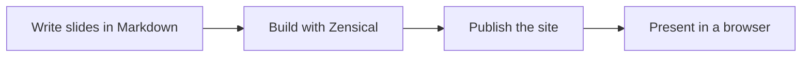

# Diagram a workflow

Write a Mermaid diagram in a fenced code block. Zensical renders it using the
active theme colors.

## Result


```mermaid
flowchart LR
  author[Write slides in Markdown]
  build[Build with Zensical]
  site[Publish the site]
  present[Present in a browser]

  author --> build
  build --> site
  site --> present
```

<!-- column-break -->

## Source

````

```mermaid
flowchart LR
  author[Write slides in Markdown]
  build[Build with Zensical]
  site[Publish the site]
  present[Present in a browser]

  author --> build
  build --> site
  site --> present
```
````
